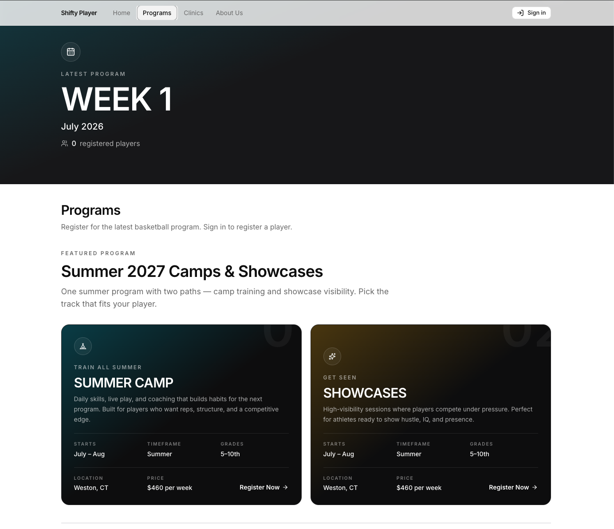

# Shifty Player management platform

Great teams need a flexible team management solution that provides a simple way to manage programs, clinics and training for youth sports.  Connect parents, players and coaches in one place.

## Getting Started

First, run the development server:

```bash
npm run dev
```

Open [http://localhost:3000](http://localhost:3000).



## Tests

- `npm test` — Vitest unit tests.
- `npm run test:e2e` — Playwright. It starts its own dev server on port 3100 (build output in `.next-e2e/`), so it can run while `npm run dev` is up on 3000. That server ignores the MongoDB, HubSpot and Stripe values in `.env.local`: tests use the in-memory store and demo checkout, and never touch real data.

## MongoDB persistence

Registration data (programs, clinics, players) and auth accounts live in **MongoDB** when `MONGODB_URI` is set. Without it, the server uses an **in-memory** store (fine for local/CI; data resets when the process restarts).

1. Create a free cluster in [MongoDB Atlas](https://www.mongodb.com/cloud/atlas).
2. Database Access → create a user; Network Access → allow your IP (or `0.0.0.0/0` for local demos).
3. Copy [`.env.example`](.env.example) values into `.env.local`:
   - `MONGODB_URI` — Atlas connection string
   - `MONGODB_DB` — database name (default `shifty`)
4. Restart `npm run dev`. The first request seeds sample programs/players and demo users (`user@demo.com` / `admin@demo.com`).
5. Reset data anytime in development: `POST /api/admin/seed` (disabled in production)

Auth uses httpOnly session cookies (`shifty_session`); passwords are bcrypt-hashed in the `users` collection.

## Stripe payments (test mode)

Parent clinic checkout uses [Stripe Payment Element](https://docs.stripe.com/payments/payment-element) when keys are configured. Without `STRIPE_SECRET_KEY`, the app keeps a **demo card form** so local/CI Playwright tests keep working.

1. Copy [`.env.example`](.env.example) to `.env.local` and set test keys from the [Stripe Dashboard](https://dashboard.stripe.com/test/apikeys):
   - `STRIPE_SECRET_KEY` — `sk_test_…`
   - `NEXT_PUBLIC_STRIPE_PUBLISHABLE_KEY` — `pk_test_…`
   - `STRIPE_WEBHOOK_SECRET` — from `stripe listen` (below)
2. Restart `npm run dev` after changing env.
3. Forward webhooks locally:
   ```bash
   stripe listen --forward-to localhost:3000/api/stripe/webhook
   ```
   Paste the printed `whsec_…` into `.env.local` as `STRIPE_WEBHOOK_SECRET`.
4. Pay with test card `4242 4242 4242 4242` (any future expiry, any CVC, any ZIP).

On the registration payment page, parents can optionally add **team gear** (t-shirt / shorts) to the same checkout. The PaymentIntent amount is tuition (`$460`) plus server-priced swag; the order snapshot is stored on the player as `merchandiseOrder`.

Flow: create PaymentIntent → confirm Payment Element → server `confirm-enrollment` retrieves the PaymentIntent from Stripe **and enrolls in MongoDB**. The webhook also enrolls idempotently and records metrics.

Paid enrollments still increment Prometheus series via `/api/metrics/events` (and the webhook) — see Metrics below.

## Metrics (Prometheus / Grafana)

The app exposes Prometheus metrics for an **existing** Prometheus/Grafana stack (for example on another machine’s Kubernetes cluster). No local Prometheus/Grafana containers are required.

| Endpoint | Purpose |
| --- | --- |
| `GET /api/metrics` | Prometheus scrape (text exposition format) |
| `POST /api/metrics/events` | Ingest demo events (`registration_started`, `payment_succeeded`, `payment_failed`) |

Useful series:

- `shifty_registrations_total` — continue-to-payment starts
- `shifty_payments_total{status="succeeded\|failed"}` — checkout outcomes
- `shifty_clinic_enrollments_total` — successful paid enrollments
- Default Node process metrics from `prom-client`

### Wire Prometheus (Docker Compose + ConfigMap)

Keep `npm run dev` running so `GET http://localhost:3000/api/metrics` works on the host.

#### A) Prometheus in **Docker Compose** (same machine as the app)

1. Add a scrape job that targets the host via `host.docker.internal:3000` (see [`observability/docker-compose-prometheus.yml`](observability/docker-compose-prometheus.yml)).
2. Ensure the Prometheus service has host access, e.g. `extra_hosts: ["host.docker.internal:host-gateway"]`.
3. Recreate/reload Prometheus, then open **http://localhost:9090/targets** and confirm `shifty-player` is **UP**.

#### B) Prometheus in **minikube** with a **ConfigMap** for `prometheus.yml`

1. From minikube, confirm the host app is reachable:
   ```bash
   minikube ssh -- curl -sS http://host.minikube.internal:3000/api/metrics | head
   ```
2. Edit your Prometheus ConfigMap and append this job under `scrape_configs` (full fragment: [`observability/prometheus-scrape-example.yml`](observability/prometheus-scrape-example.yml)):
   ```yaml
   - job_name: shifty-player
     scrape_interval: 15s
     metrics_path: /api/metrics
     scheme: http
     static_configs:
       - targets: ["host.minikube.internal:3000"]
         labels:
           app: shifty-player
           env: local
   ```
3. Apply and reload:
   ```bash
   kubectl -n <namespace> apply -f <your-prometheus-configmap>.yaml
   # Prefer lifecycle reload if enabled:
   curl -X POST http://<prometheus-ui>/-/reload
   # Or restart the Prometheus pod/deployment
   kubectl -n <namespace> rollout restart deploy/<prometheus-deployment>
   ```
4. Prometheus UI → **Status → Targets** → `shifty-player` **UP**.
5. Grafana (pointed at that Prometheus) → query `shifty_payments_total`.

**Target cheat sheet**

| Where Prometheus runs | Scrape target |
| --- | --- |
| Docker Compose on your Mac | `host.docker.internal:3000` |
| Pod inside minikube | `host.minikube.internal:3000` |

**Note:** Counters live in the Next.js process memory and reset when `next dev` restarts. This is for local/demo observability, not durable analytics.

## HubSpot CRM sync

Parents are synced to HubSpot (free CRM works) so you can run targeted marketing for renewals and upsells.

| When | What is sent |
| --- | --- |
| Parent signs up | Contact created/updated by email: name, `lifecyclestage=lead`, `shifty_marketing_opt_in`, `shifty_signup_date` |
| Clinic payment succeeds (webhook or confirm) | `lifecyclestage=customer`, player count, player grades, last program, last payment date and amount |
| Clinic payment succeeds (webhook or confirm) | Closed-won deal on the parent's contact: "Program – Surname", amount (tuition + swag), close date, program. Keyed by Stripe payment ID (`shifty_payment_id`), so retries never duplicate it |

Children's names, emails and other details are never sent to HubSpot.

**Setup**

1. In HubSpot: Settings → Integrations → Private Apps → create an app with scopes `crm.objects.contacts.read`, `crm.objects.contacts.write`, `crm.schemas.contacts.write`, `crm.objects.deals.read`, `crm.objects.deals.write`, `crm.schemas.deals.write`.
2. Add `HUBSPOT_ACCESS_TOKEN` to `.env.local` (and your hosting env vars).
3. Create the custom properties once: `HUBSPOT_ACCESS_TOKEN=pat-... node scripts/hubspot-setup.mjs`
4. Deals go to the default pipeline's `closedwon` stage. To use a dedicated "Registrations" pipeline, set `HUBSPOT_DEAL_PIPELINE` and `HUBSPOT_DEAL_STAGE` to its pipeline and closed-won stage IDs (Settings → Objects → Deals → Pipelines).
5. Build lists in HubSpot, e.g. *opted in AND lifecycle = lead* (signed up, never paid), *last payment date more than 10 months ago* (renewal/win-back), *player count ≥ 2* (sibling offers).

Syncs run with `after()` so they never slow down or break signup/checkout; failures are logged. Without the token the sync is skipped.
